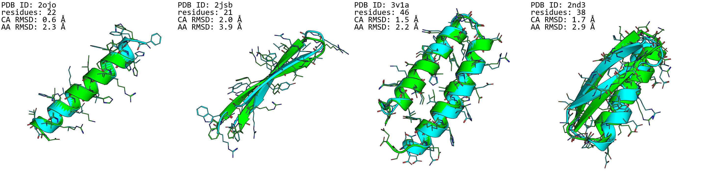

# PEPSGO

Use your custom global optimization algorithm to predict the three-dimensional structure of a peptide from its amino acid sequence. Using multivariate quantile function the continuous search space formed by Rosetta fragments and Dunbrack rotamer library. The search space is unit hypercube. 

Results using Adaptive Differential Evolution. Native (green) vs predicted (cyan).



## Requirements

To compile from source, you will need:
 * Some Linux distro (Ubuntu/Arch Linux/etc)
 * C++ compiler with C++11 support (current Makefile is GCC-based)
 * OpenMP for multithreading
 * [The Rosetta software suite](https://www.rosettacommons.org/software)

## Installation

 * Get the [Rosetta weekly source package](https://www.rosettacommons.org/software) and build it with SCons.
 * Download the source code:
```
git clone https://github.com/poluyan/PEPSGO
cd PEPSGO/
```
 * Modify the Makefile. Set the path to the Rosetta build with the kernel and gcc versions which were used in Rosetta build:
```
# 
MAIN = /path_to_Rosetta_build/rosetta_src_2019.07.60616_bundle/main
LINUXVER = 4.20
GCCVER = 8.2
```
 * Then compile PEPSGO from source with `make` command. This will generate library file `libpepsgo.so` and a file named `run.sh`.
 * The file `run.sh` process the `input` directory and get the proper input for the program.

## Input files

 * `sequence.fasta` Peptide sequence in FASTA format.
 * `fragments.Nmers` Fragment file formatted in Rosetta-style (like the output from fragment picker). Fragments can be any length.
 * `native.data` File with a path to the native structure.
 * `prediction.horiz` Secondary structure prediction in PSIPRED HFORMAT.

## Usage

The `src/main.cc` presents the example of using PEPSGO. The default `make` build contains `main.cc` compilation and linking, see `TARGET` generation in `Makefile`.

## License

The PEPSGO is distributed under Apache License 2.0 and it is open-source software. Feel free to make a copy and modify the source code, but keep the copyright notice and license intact. The PEPSGO is Rosetta-based, please read [Rosetta Licensing Information](https://www.rosettacommons.org/software) before using.
